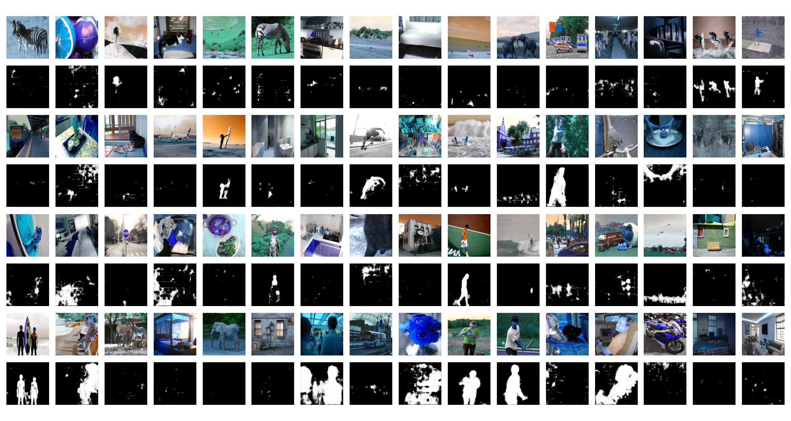

# Semantic_segmentation
This repo gives the sample code to implement semantic segmenation (people segmentation) using unet.
The dataset I used was coco2017. 

### Training Stats
The training set is train2017 and validation set is val2017.

### Inferences
The testing set is test2017. 

